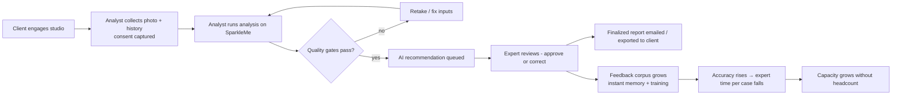

# SparkleMe — Business Requirements Document (BRD)

| | |
|---|---|
| **Document** | Business Requirements — SparkleMe Virtual Colour Analysis Platform |
| **Version** | 1.0 |
| **Date** | 2026-07-26 |
| **Business Owner** | Prabhu Balakrishnan (prabhu.balakarishnan@sharpmindlabs.com) |
| **Companions** | Functional Specification v1.0 · Technical Specification v1.0 · Expert Analysis Prompt · Audit Review Instructions |
| **Status** | Draft for stakeholder sign-off |

---

## 1. Executive Summary

Professional colour analysis — determining which colour palette harmonizes with a person's natural colouring — is today a manual, expert-scarce service. A single trained expert can complete only a handful of high-quality virtual analyses per day; demand, driven by personal styling, image consulting, and e-commerce personalization, far exceeds expert capacity, and quality varies widely across the industry.

SparkleMe productizes a proprietary, field-proven expert methodology into an AI-assisted platform. AI models perform the visual palette analysis under strict, deterministic guardrails derived from the expert's own rule system; a certified Colour Analysis Expert reviews and finalizes every result. Every expert decision instantly improves the system — corrections take effect on the very next analysis and simultaneously feed model training — so the cost of expert oversight declines as accuracy compounds.

The business outcome: scale trusted, expert-quality colour analysis from expert-hours to platform-throughput while protecting the methodology as proprietary intellectual property.

## 2. Business Objectives

| # | Objective | Measure of success |
|---|---|---|
| BO-1 | Scale analysis throughput without scaling expert headcount linearly | ≥ 10× analyses per expert-hour vs fully manual baseline within 6 months of launch |
| BO-2 | Preserve expert-level quality | ≥ 96% of AI recommendations approved by the expert without correction (first-pass accuracy) at steady state |
| BO-3 | Make expert feedback compound | Corrections per 100 analyses declining month over month; corrected cases never recur (100% rerun consistency) |
| BO-4 | Protect proprietary methodology | Rule tables, prompts, palette references, and correction data remain trade secrets; reports carry copyright/personal-use terms |
| BO-5 | Keep unit economics viable | Fully-loaded cost per analysis ≤ $1.00 at launch, ≤ $0.50 at steady state (model, compute, storage) |
| BO-6 | Avoid vendor lock-in on AI | Any model swappable within one day; platform functional on open-source models alone |
| BO-7 | Be trustworthy with biometric data | Zero PII incidents; client consent and erasure honoured end-to-end |

## 3. Problem Statement & Opportunity

**Problems today:** expert capacity is the bottleneck (analysis quality depends on one scarce skill); client self-assessment is unreliable (people misjudge their own eye pattern, hair tone, and blushing — a core finding of the methodology); existing "AI colour analysis" apps are unconstrained and frequently wrong, eroding consumer trust; manual virtual analysis workflows (spreadsheets, photo requests, hand-built reports) don't scale and leak IP.

**Opportunity:** the expert methodology is already codified into deterministic rule-outs (hair, Fitzpatrick), a 3-step drape process, and audit criteria — unusually automatable relative to competitors who rely on unguided model judgment. Expert-in-the-loop review converts every analysis into training data competitors cannot replicate, since the corrections corpus embodies the expert's judgment.

## 4. Scope

### 4.1 In scope (Release 1)

1. Web platform with three roles: Colour Analyst, Colour Analysis Expert, Admin.
2. Analyst-mediated analysis: face photo upload with automatic face-only cropping; hair colour at age 17–20 and Fitzpatrick type inputs; optional free-form client notes (skin/hair/eyes).
3. Deterministic rule-out engine (methodology Levels 1–2) constraining every result; conflict detection with human escalation.
4. AI palette analysis on overlay composites across all 10 palettes via the 3-step drape process; switchable single-model or multi-model consensus (Admin-governed).
5. Mandatory expert review: approve with comments, or correct with reasoning and prompt influence.
6. Instant feedback: corrected cases return the expert result on all subsequent identical reruns, immediately.
7. Continuous improvement: feedback corpus drives fine-tuning of open-source models and fine-tune/prompt-distillation for commercial models, gated by a golden-set regression owned by the expert.
8. Client deliverables: branded report (undertone, home season, flow, evidence, overlays) via email and PDF export, carrying copyright/personal-use notice.
9. Versioned, auditable governance of analysis & audit prompts.
10. Role-scoped dashboards (volume, accuracy, queue, cost, training health).

### 4.2 Out of scope (Release 1 — candidate roadmap items)

Direct-to-consumer self-service analysis; mobile native apps; wardrobe/product recommendations and e-commerce integrations; multi-tenancy for third-party studios; white-labelling; payments/billing engine; localization beyond English; draping for hair-colour recommendation services.

### 4.3 Explicit exclusions by design

Per methodology: eye-pattern-driven classification; use of self-reported blushing; hair-tone (vs darkness) inputs. These are excluded deliberately and permanently, not deferred.

## 5. Stakeholders

| Stakeholder | Interest / accountability |
|---|---|
| Business Owner (Sharp Mind Labs) | ROI, roadmap, pricing, IP protection |
| Methodology Owner / Colour Analysis Expert | Methodology fidelity, result quality, golden-set ownership, prompt governance |
| Colour Analysts (operations) | Throughput, usable tooling, clear input-quality guidance |
| End clients | Accurate result, fast turnaround, privacy of their photos |
| Engineering / DevOps | Buildability, operability, cost control |
| Legal / Compliance | Biometric-data lawfulness (GDPR/CCPA/BIPA-class), consumer terms, copyright |
| Finance | Unit economics, GPU/API spend visibility |

## 6. Business Requirements Catalogue

> Traceability: each BR maps to Functional Spec (FR) sections; acceptance criteria live in Functional Spec §13.

### BR-1 Quality & Trust
- BR-1.1 Every client-facing result must be finalized by a certified expert; no fully-automated result reaches a client. *(FR-5)*
- BR-1.2 The system must never output a palette the deterministic methodology has excluded. Candidate-set breaches are severity-1 incidents. *(FR-2.5, FR-2.7; Tech §9.2)*
- BR-1.3 Identical inputs must always produce identical results, so clients and analysts can trust reruns. *(FR-2.7)*
- BR-1.4 Every result must be explainable in methodology terms (evidence a–d, drape criteria cited) — both for client reports and expert efficiency. *(FR-4.3)*

### BR-2 Expert Leverage & Learning
- BR-2.1 Expert corrections must take effect immediately: the same case rerun must be correct on the 1st and every nth attempt, with no training delay. *(FR-5.3, FR-5.4)*
- BR-2.2 All expert decisions (approvals and corrections, with reasoning) must accumulate into a proprietary training corpus usable for both open-source weight training and commercial-model improvement. *(FR-7.5; Tech §8)*
- BR-2.3 Model or prompt changes must never degrade quality silently: promotion requires passing the expert-owned golden set, and accuracy must be trackable per prompt version and per model. *(FR-6.3, FR-7.4)*
- BR-2.4 The expert must be able to steer the AI directly (prompt influence text, versioned prompt editing) without engineering involvement. *(FR-5.2, FR-6)*

### BR-3 Operations & Roles
- BR-3.1 Analysts prepare and run analyses but cannot finalize; experts can operate end-to-end; admins govern the platform. Segregation of duties is enforced, not conventional. *(FR-1, §2 RBAC)*
- BR-3.2 AI engine composition (which models, single vs consensus, parameters) is a platform-level Admin decision — uniform across all analyses for consistency and auditability. *(FR-7.1)*
- BR-3.3 The expert review queue must support triage (oldest-first, escalations flagged) and complete a typical review in under 15 minutes. *(FR-8)*
- BR-3.4 Poor inputs must be caught before they cost an expert's time (image quality gates, conflicting-input detection, live rule-out preview). *(FR-2)*

### BR-4 Client Experience
- BR-4.1 Turnaround from analyst submission to finalized report ≤ 1 business day (target: same session when an expert is available).
- BR-4.2 Reports must be branded, plain-language, and carry the copyright/personal-use-only notice from the methodology owner. *(FR-4.5)*
- BR-4.3 Clients may request deletion of their photos and data at any time; honoured within 30 days. *(Tech §10.2)*

### BR-5 Economics & Independence
- BR-5.1 Per-analysis cost must be visible per model and alertable against budgets. *(Tech §9.2)*
- BR-5.2 The platform must run entirely on open-source models if commercial API terms, pricing, or privacy posture become unacceptable; switching the engine requires no code change. *(BO-6; FR-7.2)*
- BR-5.3 Face images must not be sent to commercial model providers unless explicitly enabled by the Admin under a signed data-processing agreement (default: self-hosted models only for image-bearing calls). *(Tech §10.3)*

### BR-6 IP & Compliance
- BR-6.1 Rule tables, prompts, palette swatch definitions, golden set, and the corrections corpus are trade secrets: access-controlled, watermark-free exports prohibited, included in employee/contractor confidentiality terms.
- BR-6.2 Face images and face embeddings are biometric personal data: consent captured at upload; encrypted storage; role-scoped access; retention limits; erasure and data-export (DSAR) supported. Legal review required per operating jurisdiction before launch.
- BR-6.3 Every material action (finalization, correction, prompt activation, model/parameter change, user-role change) is attributable to a person and audit-logged.
- BR-6.4 Client reports include AI-assistance disclosure ("expert-reviewed, AI-assisted analysis") where jurisdiction requires it.

## 7. Business Rules (methodology, binding on the product)

1. Ten possible outcomes: True Winter, True Summer, True Spring, True Autumn, Cool, Warm, Deep, Bright, Light, Muted.
2. Hair colour at age 17–20 (darkness only) is the most reliable check and drives Level 1 rule-outs exactly per the canonical table.
3. Fitzpatrick type drives Level 2 rule-outs exactly per the canonical table; result set = intersection of Levels 1–2.
4. Empty intersection = conflicting inputs → no result; human handling required.
5. Eyes may inform hypothesis narrative only; they never eliminate a palette.
6. Earthy-complexion and flush/blush signals are image-derived priors only (valid for Fitzpatrick I–IV and I–III respectively) — never hard rule-outs, never sourced from client self-report.
7. Drape judging uses the seven expert criteria across three ordered steps (undertone → home season → flow), always restricted to the candidate set.
8. Skin-characteristic profiles per palette corroborate but do not decide.
9. The expert's decision is final and overrides the AI in all cases.

## 8. Success Metrics & KPIs

| KPI | Definition | Launch target | Steady state |
|---|---|---|---|
| First-pass accuracy | % AI recommendations approved unchanged | ≥ 85% | ≥ 96% |
| Correction recurrence | Corrected case returning wrong on rerun | 0 | 0 |
| Expert review time | Median minutes per review | ≤ 15 | ≤ 8 |
| Turnaround | Submission → finalized report | ≤ 1 business day | ≤ 4 hours |
| Throughput leverage | Analyses finalized per expert-hour | ≥ 4× manual | ≥ 10× manual |
| Cost per analysis | Fully-loaded infra + model cost | ≤ $1.00 | ≤ $0.50 |
| Candidate-set breaches | Results outside methodology constraints | 0 | 0 |
| Input rejection rate | Submissions failing quality gates | ≤ 15% (with analyst coaching) | ≤ 5% |
| Correction trend | Corrections per 100 analyses | baseline | declining MoM |
| Privacy incidents | Biometric-data breaches / complaints | 0 | 0 |

## 9. Assumptions

1. A certified Colour Analysis Expert is available for daily queue coverage during business hours.
2. The methodology owner authorizes digitization of rule tables, palettes, prompts, and workbook assets, and owns the golden set.
3. Analysts can be trained to capture compliant photos (indoor even lighting, no heavy makeup) or coach clients to.
4. Open-source vision models (Llama 4 class, Kimi-VL) are of sufficient quality for drape judging once constrained by rule-outs and improved by feedback; validated in M2–M4 before scale-up.
5. Azure GPU capacity/quota is obtainable for training and inference within budget.
6. Volume assumption for sizing: 50–200 analyses/day in year 1.

## 10. Constraints

1. Open-source-only software stack (commercial model APIs excepted); PostgreSQL and Keycloak mandated.
2. Expert review is mandatory for every client-facing result (regulatory posture and brand promise).
3. Determinism and instant-feedback guarantees are non-negotiable product behaviours.
4. MLOps training runs on Azure VMs.
5. Budget ceiling for recurring infrastructure to be set by Finance before M4 (GPU inference is the dominant cost driver).

## 11. Dependencies

| Dependency | Needed by | Risk if late |
|---|---|---|
| Legal review of biometric processing per target market | Launch | Launch blocked in affected markets |
| DPAs with commercial model providers (if images enabled) | M4 | Commercial models restricted to text adjudication |
| Golden set (≥50 expert-labelled cases) | M4 | No safe model/prompt promotion |
| Expert availability for review + prompt governance | M3 onward | Queue backlog, learning loop stalls |
| Azure GPU quota (A100/H100) | M4–M5 | Consensus mode limited to hosted models |
| Brand assets & report copy | M3 | Unbranded client deliverables |

## 12. Risks & Mitigations

| # | Risk | L | I | Mitigation |
|---|---|---|---|---|
| R1 | Open-source model quality insufficient for drape judging | M | H | Rule-out constraints shrink the decision space; consensus with commercial models; feedback loop; go/no-go checkpoint at M4 with golden set |
| R2 | Expert becomes single point of failure | M | H | Train a second reviewer; audit prompts encode expert criteria; corrections corpus preserves judgment institutionally |
| R3 | Biometric-privacy regulatory exposure (GDPR/BIPA-class) | M | H | Default self-hosted-only for images; consent + erasure; legal review gate; encryption; minimal retention |
| R4 | Skin-tone fairness: accuracy uneven across Fitzpatrick types | M | H | Golden set stratified across all types I–VI and all 10 palettes; accuracy KPI reported per Fitzpatrick band; imbalance blocks promotion |
| R5 | GPU cost overrun | M | M | Spot training VMs; quantized inference; LiteLLM budgets + alerts; single-model mode as cost fallback |
| R6 | IP leakage of prompts/rule tables/corrections | L | H | Trade-secret handling, access control, audit logs, no client-side exposure of rules; contractual terms |
| R7 | Clients misreport hair colour / Fitzpatrick → wrong candidate sets | H | M | "I do not know" path; historical-photo guidance; conflict detection; expert catches at review |
| R8 | Over-reliance on memory overrides masking model weakness | L | M | Memory-hit rate monitored; hits excluded from accuracy KPI; training pipeline judged on memory-miss cases only |
| R9 | Provider API terms/pricing change | M | M | BR-5.2 model independence; open-source parity maintained |

## 13. Business Process (target operating model)

## 14. Release Phasing (business view)

| Phase | Business capability unlocked | Gate to proceed |
|---|---|---|
| P1 (M1–M2) | Internal pilot: analysts run analyses on one hosted model; expert reviews manually | Pipeline produces methodology-compliant results on test cases |
| P2 (M3) | Learning loop live: instant corrections, prompt governance | Rerun consistency 100%; expert signs off review UX |
| P3 (M4) | Consensus engine + open-source models; cost controls | Golden-set accuracy ≥ 85%; cost/analysis within target |
| P4 (M5) | Self-improving: training pipeline promotes models safely | First promoted model beats baseline on golden set |
| P5 (M6+) | Commercial launch to client-facing volume | KPIs green 4 consecutive weeks; legal sign-off |

## 15. Open Business Decisions

1. Pricing model — per analysis, subscription per studio seat, or bundled with styling services?
2. Direct-to-consumer channel timing (currently out of scope) and its regulatory implications.
3. Second certified expert: hire/train timeline (R2).
4. Target launch jurisdictions (drives the biometric legal review scope).
5. Data retention default — proposal 90 days post-finalization for images; indefinite for anonymized metrics.
6. Whether "AI-assisted" disclosure appears on all reports or only where legally required.

## 16. Glossary

| Term | Meaning |
|---|---|
| Palette / Flow | One of ten possible analysis outcomes (4 true seasons + 6 flows) |
| Candidate set | Palettes remaining after deterministic Levels 1–2 rule-outs |
| Drape steps | 3-step visual comparison: undertone → home season → flow |
| Seven criteria | Facial details, skin colour, skin consistency, jaw line, eyes, focus, balance |
| Correction memory | Instant layer returning expert-verified results for known cases |
| Golden set | Expert-labelled benchmark gating any model/prompt promotion |
| First-pass accuracy | Share of AI recommendations approved without correction |
| Consensus mode | Multiple models vote; weighted majority (or other strategy) decides |
| Fitzpatrick scale | Skin-type classification I–VI used for Level 2 rule-outs |
