# SparkleMe — Functional Specification

| | |
|---|---|
| **Document** | Functional Specification — SparkleMe Virtual Colour Analysis Platform |
| **Version** | 1.0 |
| **Date** | 2026-07-26 |
| **Owner** | Prabhu Balakrishnan (prabhu.balakarishnan@sharpmindlabs.com) |
| **Audience** | Engineering, QA, DevOps |
| **Status** | Draft for engineering review |

> All Mermaid diagrams render natively in GitHub, GitLab, VS Code, and Confluence (with the Mermaid plugin).

---

## 1. Product Overview

SparkleMe determines which one of **ten colour palettes** harmonizes with a person's natural colouring, digitizing a proprietary expert methodology. A Colour Analyst uploads a client's face photo plus two self-report inputs; the platform runs deterministic rule-outs, composites the cropped face onto palette overlays, and drives one or more AI models through a 3-step drape comparison. A Colour Analysis Expert reviews, refines, and finalizes every result. Expert feedback takes effect **instantly** (correction memory) and **cumulatively** (model training).

### 1.1 The Ten Palettes

Four true home seasons and six flow palettes (each a blend of two seasons):

| Palette | Type | Parents / Undertone | Reference swatches (from expert workbook) |
|---|---|---|---|
| True Winter | Home season | Cool | #66008D #000000 #A50046 #FF00A0 #000AC6 |
| True Summer | Home season | Cool | #875F96 #B7AFB0 #AA415F #DB8FA6 #6472A0 |
| True Spring | Home season | Warm | #FCFB58 #E19673 #FF304B #FF967D #4EFD67 |
| True Autumn | Home season | Warm | #9B710B #4B2819 #932516 #F24C03 #265E25 |
| Cool | Flow | Winter + Summer | #8535A3 #464141 #B9215C #ED4D9A #3D429A |
| Warm | Flow | Autumn + Spring | #E9BA47 #713F29 #F42E24 #DC6F39 #5BBA4F |
| Deep | Flow | Winter + Autumn | #551455 #3C141E #8C002F #6E002D #073342 |
| Bright | Flow | Spring + Winter | #F000FA #46000F #D20046 #FF3F7F #00AAAA |
| Light | Flow | Spring + Summer | #E4DBD3 #E13750 #FAADAD #82D9DC |
| Muted | Flow | Autumn + Summer | #5A4646 #A53C50 #CD737D #3A5D68 |

Valid flows per home season — **Winter:** True Winter, Cool, Deep, Bright · **Summer:** True Summer, Cool, Light, Muted · **Spring:** True Spring, Warm, Light, Bright · **Autumn:** True Autumn, Warm, Deep, Muted.

### 1.2 Fixed Methodology Principles (system invariants)

1. Eye colour/pattern is **hypothesis only** — never rules a palette in or out.
2. Hair darkness-lightness at age 17–20 is the most reliable input; hair *tone* is never used.
3. Self-reported blush/flush and eye pattern are untrusted; image-derived signals only, weak weight.
4. **Deterministic rule-outs always win** over model judgment. A result outside the candidate set is a hard failure.
5. The pipeline must be **deterministic**: identical inputs → identical output, on the 1st and nth run.

---

## 2. Roles & Permissions (RBAC)

| Capability | Colour Analyst | Colour Analysis Expert | Admin |
|---|---|---|---|
| Sign in / dashboard (role-scoped) | ✔ | ✔ | ✔ |
| Start analysis (image + inputs + free-form notes) | ✔ | ✔ | ✔ |
| View analyses list/detail, overlays | ✔ (own + team, read-only pending) | ✔ | ✔ |
| Submit analysis for expert review | ✔ (automatic on run) | n/a (may self-finalize) | ✔ |
| Approve & finalize with comments | ✖ | ✔ | ✔ |
| Correct / refine with additional prompt influence | ✖ | ✔ | ✔ |
| Rerun analysis | ✖ | ✔ | ✔ |
| Email / export report | ✔ (finalized only) | ✔ | ✔ |
| Manage prompt versions (analysis + audit) | ✖ | ✔ | ✔ |
| Model configuration (registry, mode, consensus) | ✖ | ✖ | ✔ |
| User management | ✖ | ✖ | ✔ |
| Training pipeline operations | ✖ | ✖ | ✔ |
| Platform metrics | own metrics | review metrics | all metrics |

Key rule: **model selection is platform-wide Admin configuration** — never a per-analysis choice by analysts or experts.

---

## 3. Business Architecture Flow

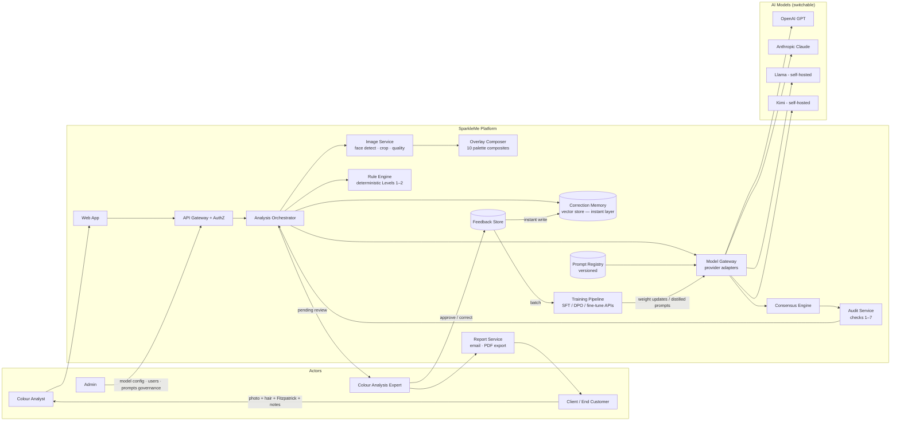

**Value loop:** every expert decision becomes training signal. The instant layer (correction memory) guarantees immediate correctness on reruns; the batch layer (training pipeline) improves generalization to new faces; declining correction volume is the primary health metric.

---

## 4. User Journey Maps

### 4.1 Colour Analyst journey

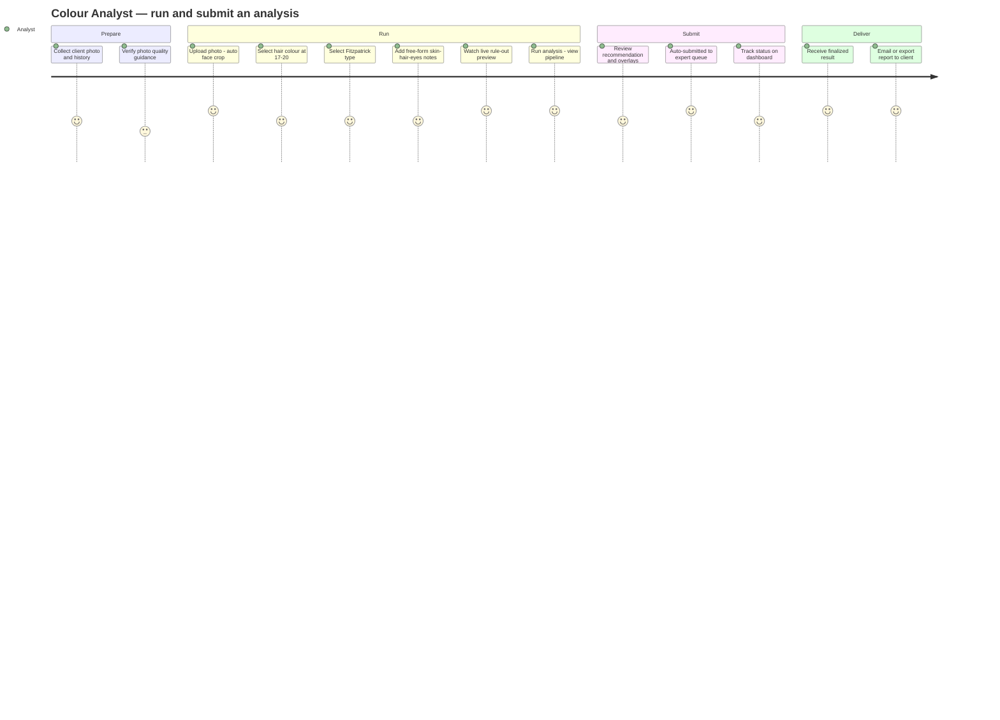

### 4.2 Colour Analysis Expert journey

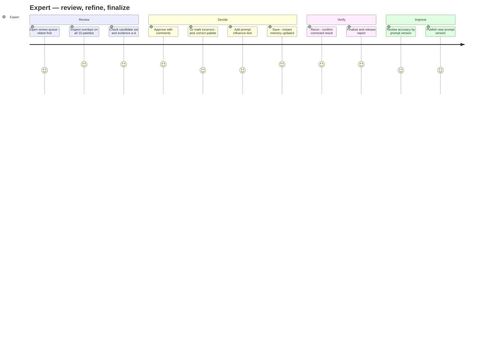

### 4.3 Admin journey

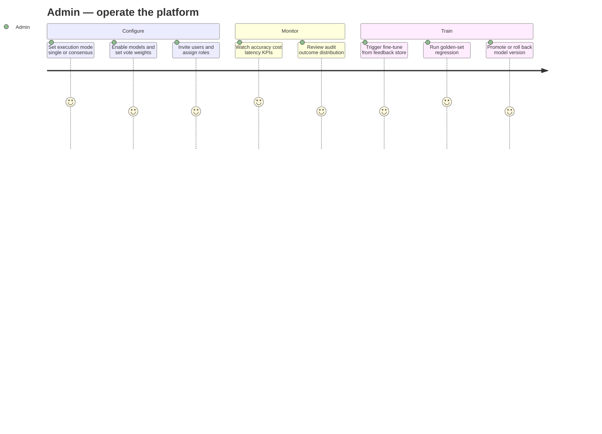

---

## 5. Core Domain Logic

### 5.1 Level 1 rule-outs — natural hair colour at age 17–20 (canonical table)

| Selection | CANNOT be | Remaining possibilities |
|---|---|---|
| Dark Blonde / Blonde / Light Blonde / Very Light Blonde / Lightest Blonde | True Winter, True Autumn, Deep, Muted, Bright, Cool, Warm | True Spring, True Summer, Light |
| Light Brown | True Winter, True Autumn, Deep, Muted, Bright, Cool | True Spring, True Summer, Light *(rare — kept for safety)*, Warm *(rare — kept for safety)* |
| Brown | True Winter, Light, Bright, Deep, Cool | True Autumn, True Spring, True Summer, Warm, Muted |
| Dark Brown / Darkest Brown / Black | Light | all nine others |
| Obvious Red Hair | True Winter, True Summer, Light, Deep, Bright, Cool, Muted | True Spring, True Autumn, Warm |
| I Do Not Know | — | all ten |

### 5.2 Level 2 rule-outs — Fitzpatrick type

| Type | CANNOT be | Remaining |
|---|---|---|
| V, VI | True Summer, True Spring, Light | True Autumn, True Winter, Deep, Bright, Muted, Cool, Warm |
| III, IV | Light | all except Light |
| I, II | — | all ten |

**Candidate set = Level 1 ∩ Level 2.** Empty set → `CONFLICTING_INPUTS`, human review, no result.

### 5.3 Levels 3–4 (image-derived priors, never hard rule-outs)

- **Level 3 — Earthy complexion** (Fitzpatrick I–IV only): opaque orange-brown earthiness → strong prior for True Autumn, then Warm; rarely True Spring/Muted/Deep. Must not be triggered by sun/environment mottling (common in True Summer).
- **Level 4 — Flush/blush** (Fitzpatrick I–III only): authentic high cheek colour/translucency → weak prior for True Spring, Warm, Light, Bright. Image-derived only; never from user self-report (including free-form notes).

### 5.4 Drape comparison — the seven judgment criteria

At every overlay comparison the model judges: ① facial details emphasized vs diminished, ② skin colour unhealthy/grayish/jaundiced vs healthy/rosy/golden glow, ③ skin consistency patchy vs smooth, ④ jaw line dropped vs lifted, ⑤ eyes dull vs sparkling, ⑥ focus pulled to jawline vs up to eyes, ⑦ balance disconnected vs harmonious. Steps: **1)** Cool vs Warm → **2)** home season (Winter/Summer if cool; Spring/Autumn if warm) → **3)** flow within home season, restricted to the candidate set throughout.

### 5.5 Output contract (per analysis)

```json
{
  "status": "OK | INVALID_INPUT | CONFLICTING_INPUTS | NEEDS_HUMAN_REVIEW",
  "undertone": "Cool | Warm",
  "home_season": "Winter | Summer | Spring | Autumn",
  "flow_result": "<one of ten palettes>",
  "confidence": "High | Medium | Low",
  "candidate_set": ["..."],
  "evidence": {
    "a_eyes": "hypothesis only",
    "b_hair": "selection + rule-out outcome",
    "c_skin": "observed characteristics vs palette profile",
    "d_drape_steps": [{"step": 1, "winner": "...", "criteria_cited": [1,2,4,5,6,7]}]
  },
  "model_votes": [{"model": "...", "vote": "...", "raw": "..."}],
  "prompt_version": "v1.3",
  "engine": {"mode": "consensus", "strategy": "weighted_majority"}
}
```

Hard constraints validated before persisting: `flow_result ∈ candidate_set`; flow valid for `home_season`; `home_season` consistent with `undertone`. Violation → `NEEDS_HUMAN_REVIEW`, never silently fixed.

---

## 6. End-to-End Analysis Flowchart

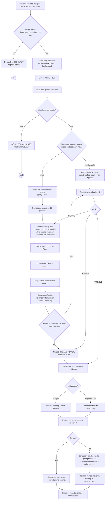

---

## 7. Sequence Diagrams

### 7.1 Run analysis (multi-model consensus)

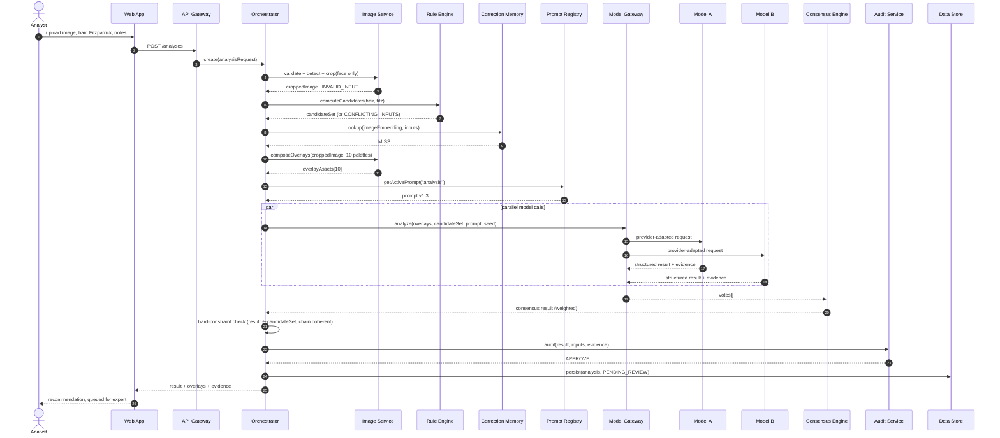

### 7.2 Expert correction with instant feedback (the 1st/nth-rerun guarantee)

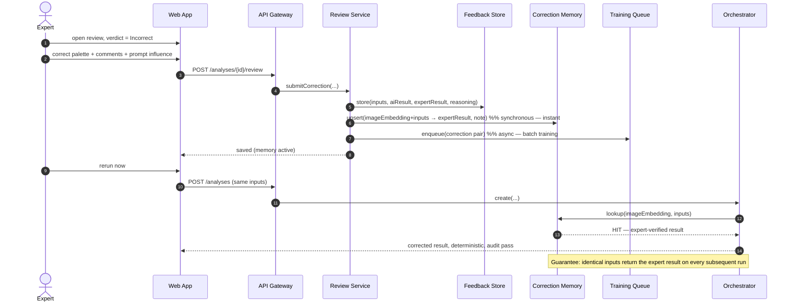

### 7.3 Prompt version lifecycle

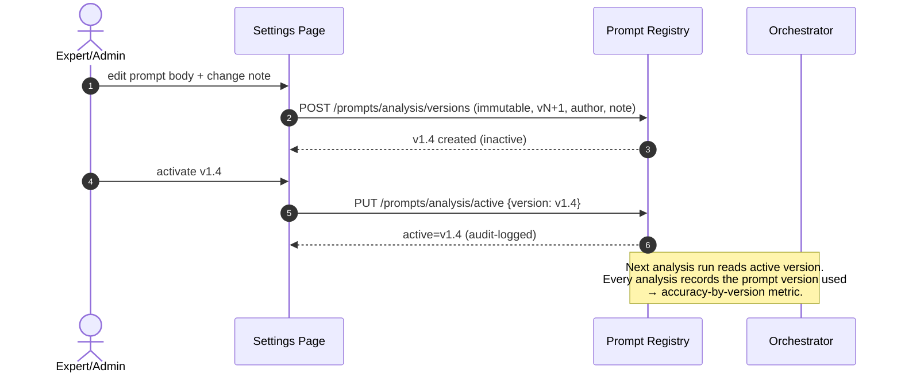

### 7.4 Background training pipeline

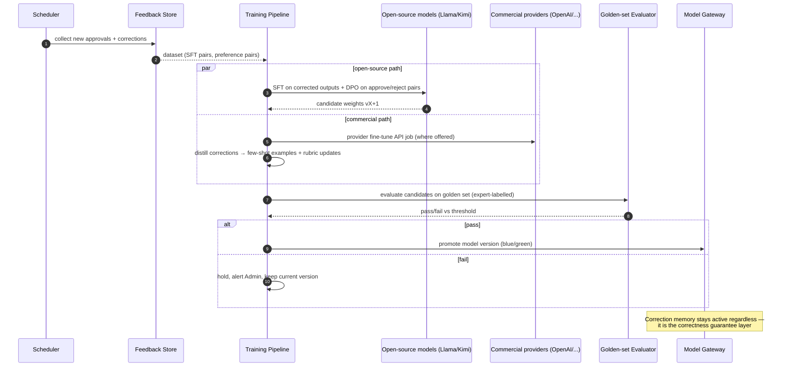

---

## 8. Analysis Lifecycle State Machine

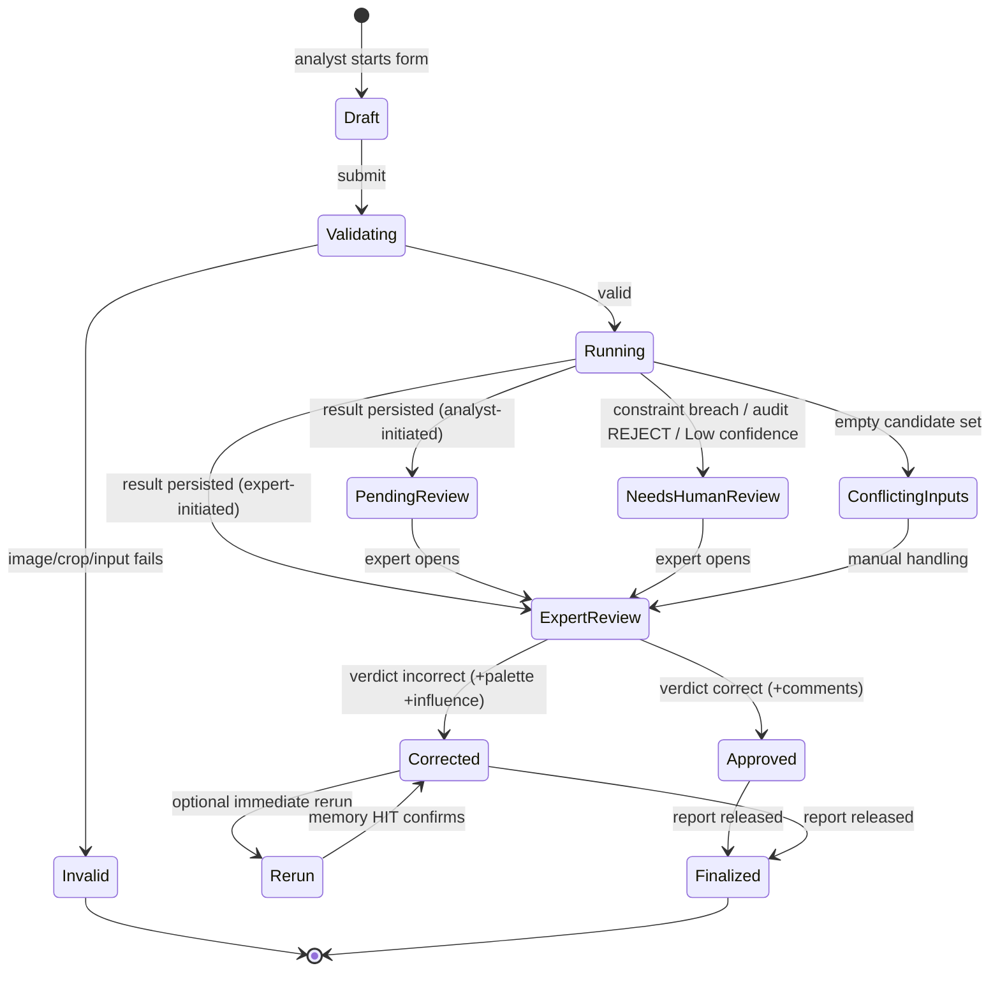

Status → UI mapping: `PendingReview` = "Pending Review", `Approved`, `Corrected`, `NeedsHumanReview` = "Needs Human Review".

---

## 9. Data Model

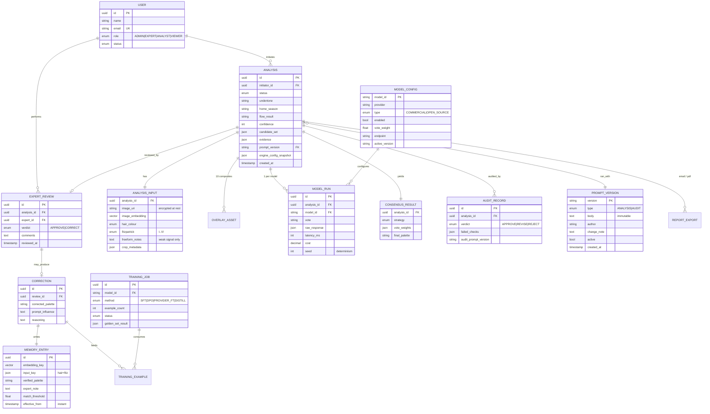

Notes: `engine_config_snapshot` freezes mode/strategy/models per analysis for reproducibility. `PROMPT_VERSION.body` is immutable — edits always create a new version. `MEMORY_ENTRY.effective_from` is the write timestamp; lookups are synchronous on every run.

---

## 10. Functional Requirements by Module

### FR-1 Authentication & Session
- FR-1.1 Email/password sign-in; SSO-ready. Session JWT carries role claims.
- FR-1.2 Role-based navigation: Analyst (Dashboard, Analyses, Start), Expert (+Settings), Admin (+Admin console).
- FR-1.3 Suspended users are blocked at sign-in with a support message.

### FR-2 Start Analysis
- FR-2.1 Image upload (JPEG/PNG/HEIC ≥ 800px face height). Face detection must find exactly one face; else reject with reason.
- FR-2.2 Auto-crop to face only (exclude hair, ears, neck, background). Crop mask stored for audit. Manual crop adjustment allowed before run, re-validated after.
- FR-2.3 Hair selector: exactly the 12 canonical values (§5.1). Fitzpatrick selector: I–VI with descriptions.
- FR-2.4 Free-form text field for skin/hair/eyes details. Persisted, passed to models as *weak supporting context*; MUST NOT alter rule-outs; blush/flush claims within it MUST be ignored per methodology.
- FR-2.5 Live rule-out preview: Level 1, Level 2, and intersection update on every input change; empty intersection disables Run and explains why.
- FR-2.6 Run executes the pipeline in §6 with the Admin-configured engine (read-only banner shows current engine). Progress stepper reflects real pipeline stages.
- FR-2.7 Determinism: seeded inference (temperature 0 or fixed seed), snapshotted prompts/config; a duplicate submission returns byte-identical results.

### FR-3 Analyses Listing
- FR-3.1 Columns: ID, client, date, inputs summary, AI result, expert result, confidence, status.
- FR-3.2 Search (name/ID), filters (status, palette, model, date range, initiator), sortable columns, pagination (50/page), CSV export.
- FR-3.3 Row click → Detail. Analysts see pending items read-only.

### FR-4 Analysis Detail
- FR-4.1 Overlay grid: face composited on all 10 palettes; recommended card highlighted. Click to zoom; side-by-side compare of any two.
- FR-4.2 Result panel: undertone, home season, flow, confidence, candidate-set chips, model votes with consensus explanation.
- FR-4.3 Evidence a–d exactly per output contract (§5.5), including which of the 7 criteria drove each drape step.
- FR-4.4 Actions by role/status: Expert sees Approve & Finalize / Correct on pending; Rerun/Refine on finalized. Analyst sees status chip only.
- FR-4.5 Email report (templated, branded, copyright notice from expert workbook); Export PDF (print-optimized layout).

### FR-5 Review / Correction / Rerun
- FR-5.1 Verdict = Correct → approval comments required; stored as positive training example; status → Approved.
- FR-5.2 Verdict = Incorrect → corrected palette (constrained to candidate set), comments, optional prompt-influence text.
- FR-5.3 Save writes synchronously to correction memory (instant) and asynchronously to training queue. UI confirms both.
- FR-5.4 Rerun button executes a full new analysis; log panel shows rule-out recomputation, memory lookup result (HIT/MISS), and final result. Post-correction rerun MUST return the expert palette (memory HIT) — this is an automated regression test.
- FR-5.5 Correcting to a palette outside the candidate set is blocked with an explanation (inputs must be fixed instead — new analysis).

### FR-6 Settings — Prompt Management
- FR-6.1 Two prompt types: Analysis, Audit. Versions are immutable; saving creates vN+1 with author + change note.
- FR-6.2 Exactly one active version per type; activation is instant for subsequent runs and audit-logged.
- FR-6.3 Version list shows accuracy (first-pass approval rate) measured while each version was active.
- FR-6.4 Rollback = activating an older version. Diff view between any two versions.

### FR-7 Admin Console
- FR-7.1 **Execution mode** (platform-wide): single model (pick primary) or multi-model consensus (strategy: weighted majority / auditor-scored best / unanimity-else-escalate). Applies to all analyses; snapshotted per analysis.
- FR-7.2 Model registry: add/enable/disable models, endpoints, credentials (vaulted), vote weights, view accuracy/latency/cost. Provider adapters: OpenAI-compatible, Anthropic, self-hosted (vLLM/TGI).
- FR-7.3 User management: invite, role assignment, suspend/reactivate.
- FR-7.4 Metrics: accuracy by model/prompt/palette-boundary, corrections trend, audit outcomes, cost & latency, rerun-consistency (must be 100%).
- FR-7.5 Training pipeline: feedback-store counts, live memory entries (view/expire), trigger training runs, golden-set evaluation, promote/rollback model versions (blue/green).

### FR-8 Dashboards (role-scoped)
- Analyst: submissions/week, awaiting review, first-pass approval rate, time-to-decision, rejection/rework rates, conflicting-input count, palette distribution, input-quality tips.
- Expert: queue depth & age, avg review time, AI first-pass accuracy, corrections by drape step, AI↔expert agreement by palette boundary, instant-memory count, rerun consistency, accuracy by prompt version.
- Admin: totals & trends, active users, cost/analysis, latency, model comparison + consensus uplift, corrections trend, training health, audit distribution.

---

## 11. API Sketch (REST)

| Method & Path | Purpose | Roles |
|---|---|---|
| `POST /auth/login` | authenticate → JWT | all |
| `POST /analyses` | create & run analysis (multipart: image + inputs) | Analyst, Expert, Admin |
| `GET /analyses?query&status&palette&sort&page` | listing | all (scoped) |
| `GET /analyses/{id}` | detail incl. overlays, evidence, votes | all (scoped) |
| `POST /analyses/{id}/review` | approve or correct (body: verdict, palette?, comments, influence?) | Expert, Admin |
| `POST /analyses/{id}/rerun` | rerun with identical inputs | Expert, Admin |
| `POST /analyses/{id}/report/email` · `GET .../report/pdf` | delivery | per FR-4.5 |
| `GET/POST /prompts/{type}/versions` · `PUT /prompts/{type}/active` | prompt registry | Expert, Admin |
| `GET/PUT /admin/engine` | mode/strategy/primary | Admin |
| `GET/POST/PATCH /admin/models` | registry | Admin |
| `GET/POST/PATCH /admin/users` | user mgmt | Admin |
| `GET /admin/memory` · `DELETE /admin/memory/{id}` | correction memory ops | Admin |
| `POST /admin/training/jobs` · `GET /admin/training/jobs` | training ops | Admin |
| `GET /metrics/{scope}` | dashboards | role-scoped |

All mutating endpoints are idempotent via `Idempotency-Key`. Analysis creation is async-capable: `202 Accepted` + `GET /analyses/{id}/status` for long runs; server-sent events for the pipeline stepper.

---

## 12. Non-Functional Requirements

| Area | Requirement |
|---|---|
| **Determinism** | Identical inputs (image hash + hair + Fitzpatrick + engine snapshot + prompt version) → identical output. Seeded/temperature-0 inference; deterministic consensus tie-breaks (fixed model ordering); versioned rule tables. |
| **Instant feedback** | Correction-memory write is synchronous with review save; lookup on every run; post-correction rerun consistency = 100% (release-blocking metric). |
| **Latency** | p50 ≤ 40s, p95 ≤ 90s end-to-end (upload → recommendation) in consensus mode; rule-outs and memory lookup ≤ 200ms. |
| **Privacy & security** | Face images are biometric PII: encrypt at rest (KMS) and in transit; signed short-lived URLs for overlays; role-scoped access; consent capture at upload; configurable retention & right-to-erasure (delete image + embedding + memory entries; keep anonymized metrics). Provider data-processing agreements required before enabling commercial models; option to restrict PII-bearing calls to self-hosted models only. |
| **Auditability** | Every result reproducible from stored snapshots (prompt version, engine config, model versions, seeds, rule-table version). All admin/expert actions audit-logged. |
| **Availability** | 99.5% for the app; analysis degrades gracefully — if a model fails, consensus proceeds with remaining models above quorum, else queue & notify. |
| **Scalability** | Stateless orchestrator; queue-based model calls; horizontal scaling of image service; vector store sized for ≥1M memory entries with <100ms ANN lookup. |
| **Observability** | Traces per pipeline stage; metrics: accuracy, correction rate, memory hit rate, cost/analysis, audit failures by check ID; alerting on candidate-set breach (should be zero). |
| **I18n/A11y** | UI copy externalized; WCAG 2.1 AA; palette cards carry text labels (never colour-only meaning). |

---

## 13. Acceptance Criteria (key scenarios)

1. **Rule-out enforcement:** Blonde + Fitzpatrick II → candidate set exactly {True Spring, True Summer, Light}; any model vote outside it is discarded and logged; if consensus lands outside → NEEDS_HUMAN_REVIEW.
2. **Conflicting inputs:** Blonde + Fitzpatrick VI → empty set → Run blocked in UI; API returns CONFLICTING_INPUTS; case appears in expert queue.
3. **Instant feedback:** Expert corrects #X from True Spring → Light; immediate rerun and 10 subsequent reruns of identical inputs all return Light with memory-HIT evidence.
4. **Determinism:** Same submission twice (no correction between) → identical `flow_result`, `confidence`, `evidence`.
5. **Prompt versioning:** Activating v1.4 → next run records v1.4; deactivated versions remain viewable; accuracy metric starts accruing to v1.4.
6. **RBAC:** Analyst calling `POST /analyses/{id}/review` → 403. Analyst UI shows no approve/correct controls.
7. **Engine governance:** Changing mode to single/Claude → subsequent analyses record `engine.mode=single`; no per-analysis model choice appears for any non-admin role.
8. **Report:** Finalized analysis → PDF contains result, undertone/season/flow, evidence a–d, overlay images, expert comments, and the copyright/personal-use notice.

---

## 14. Open Questions for Product Owner

1. Client-facing portal (clients submit their own photos) — in scope for v1 or analyst-mediated only?
2. Retention period for face images/embeddings after finalization (proposal: 90 days, configurable)?
3. Near-match threshold for correction memory (same person, new photo) — similarity cutoff and expert notification behaviour?
4. Golden-set size/ownership and the promotion threshold (proposal: ≥96% agreement, zero candidate-set breaches)?
5. Commercial-model PII policy: allow face images to OpenAI/Anthropic with DPAs, or restrict image-bearing calls to self-hosted models?
6. Billing/quota model per analyst seat or per analysis?

---

## Appendix A — Reference documents

- Expert Analysis Prompt (expert-analysis-prompt.md) — the operational analyst-model prompt.
- Audit Review Instructions (audit-review-instructions.md) — auditor pass, checks 1–7, verdict rules.
- Algorithm Inputs (expert PDF) — Levels 1–4 methodology and canonical hair table.
- Skin Characteristics by Palette (expert PDF) — corroboration profiles.
- Expert workbook (.xlsm) — drape step sheets and palette swatch sources.
- Interactive prototype (sparkleme-prototype.html) — reference UX for all screens.
