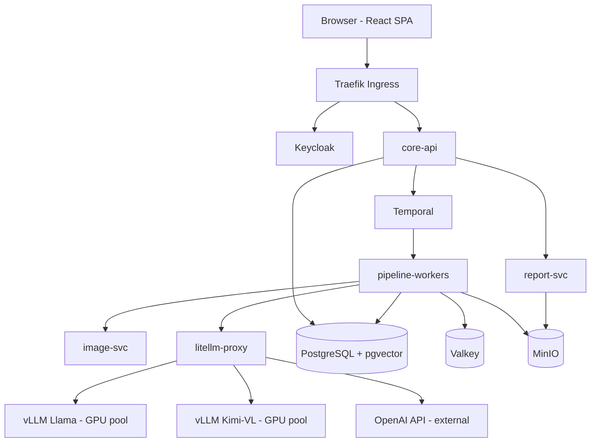
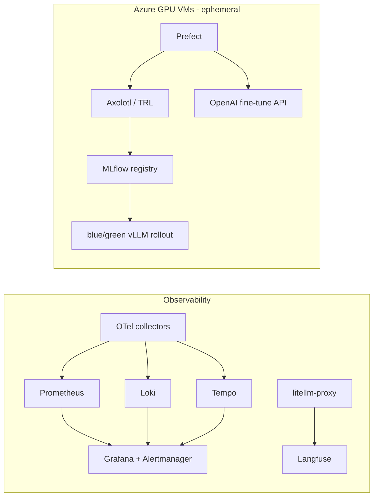
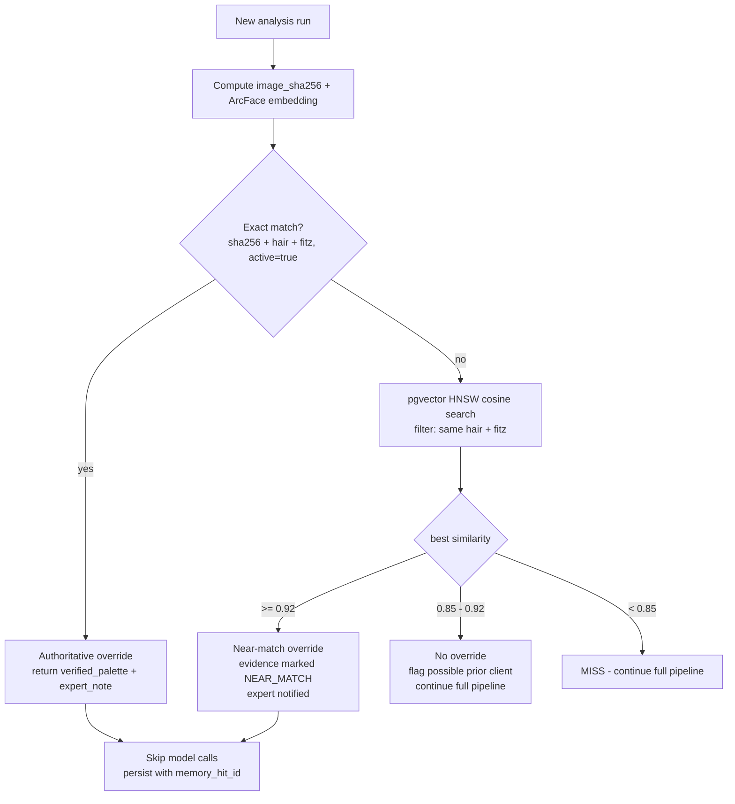
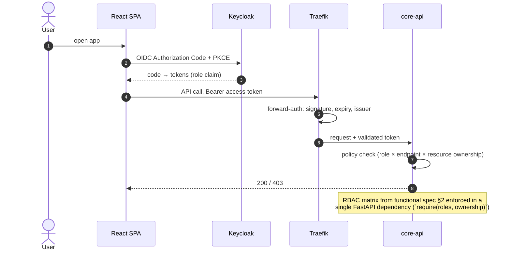
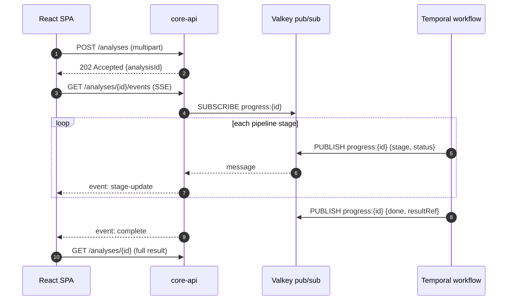
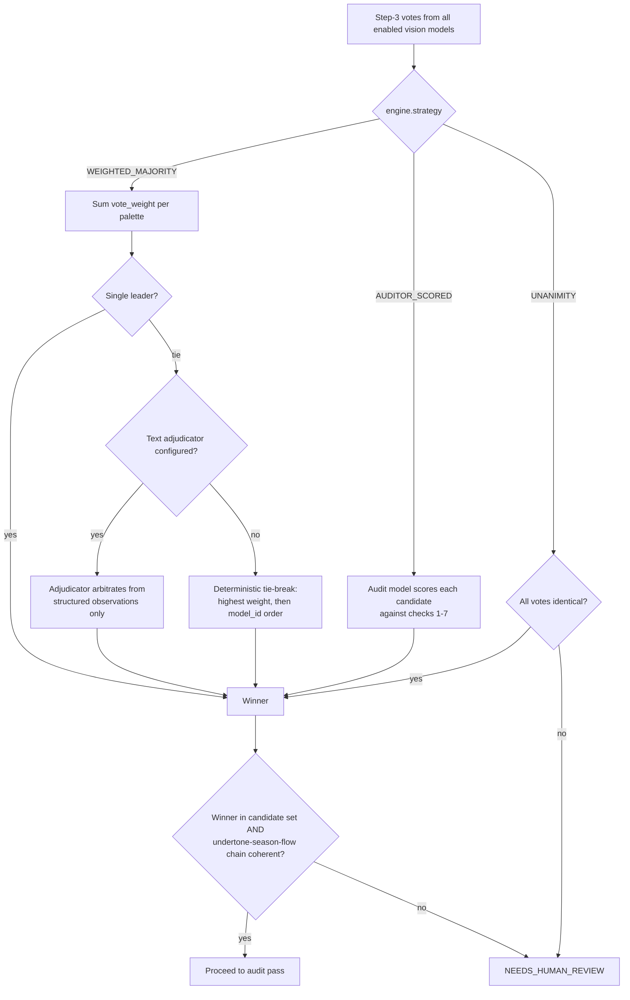
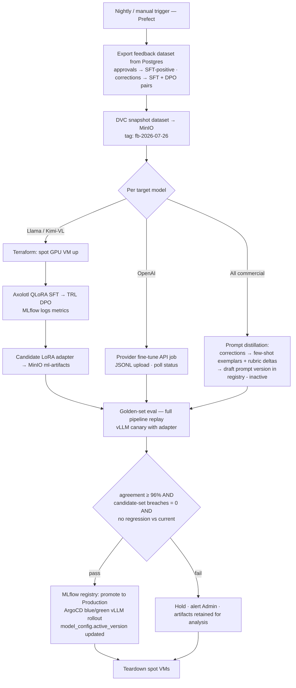
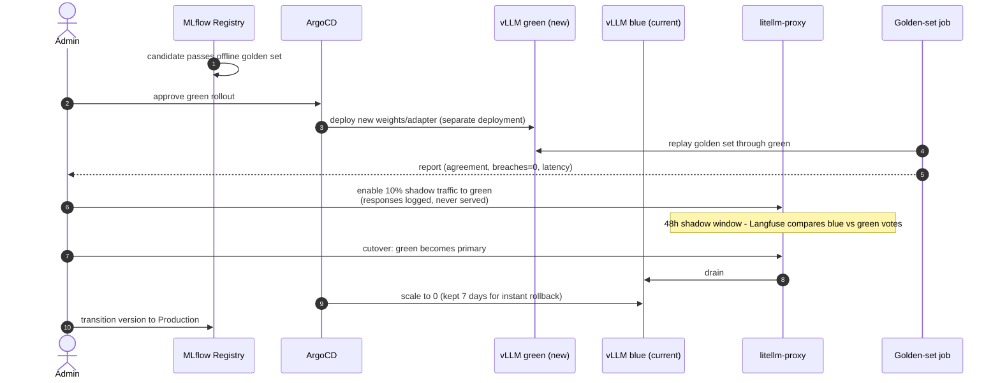
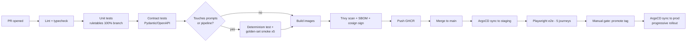

# SparkleMe — Technical Specification

| | |
|---|---|
| **Document** | Technical Specification — SparkleMe Virtual Colour Analysis Platform |
| **Version** | 1.0 |
| **Date** | 2026-07-26 |
| **Owner** | Prabhu Balakrishnan (prabhu.balakarishnan@sharpmindlabs.com) |
| **Companion** | Functional Specification v1.0 (sparkleme-functional-spec.md) |
| **Constraint** | Open-source only (except commercial model APIs); PostgreSQL; Keycloak; Azure VMs for MLOps |

---

## 1. Tech Stack Recommendation

### 1.1 Summary

| Layer | Recommendation | Version | Licence | Why this choice |
|---|---|---|---|---|
| Frontend | React + TypeScript + Vite | React 19 / Vite 6 | MIT | Prototype is already React-shaped; largest talent pool; Vite for fast internal-tool DX. SSR not needed (authenticated internal app). |
| UI kit / styling | Tailwind CSS 4 + shadcn/ui + Radix | latest | MIT | Accessible primitives, themeable to the peacock design system extracted from the prototype. |
| Data fetching / state | TanStack Query v5 + TanStack Router + Zustand | latest | MIT | Server-state caching for listings/dashboards; SSE support for the pipeline stepper. |
| Charts | Apache ECharts | 5.x | Apache-2.0 | Dashboard-heavy product; ECharts covers bars/heatmaps/gauges without licence issues. |
| Backend framework | Python 3.12 + FastAPI + Pydantic v2 | latest | MIT | Single language across API, image pipeline, and ML tooling; Pydantic enforces the analysis output contract as code. |
| Workflow engine | Temporal OSS | 1.x | MIT | The analysis pipeline is a multi-step, retryable, **deterministic** workflow — Temporal gives durable execution, replayable history (audit), and per-step retries out of the box. |
| API gateway / ingress | Traefik | 3.x | MIT | OIDC forward-auth with Keycloak, rate limiting, canary routing. (Kong OSS acceptable alternative.) |
| Identity & RBAC | **Keycloak** | 26.x | Apache-2.0 | Mandated. OIDC/OAuth2, realm roles, admin API for user management page. |
| Relational DB | **PostgreSQL** | 17 | PostgreSQL | Mandated. Plus **pgvector 0.8** extension → correction memory (vector similarity) lives inside the transactional DB: the instant-feedback write is one ACID transaction, no dual-store consistency problem. |
| Cache / queues / rate-limit | Valkey | 8.x | BSD-3 | Open-source Redis fork (Redis itself is no longer OSI-licensed). SSE fan-out, idempotency keys, hot config cache. |
| Object storage | MinIO | latest | AGPL-3.0 | S3-compatible for face images, crops, overlay composites, report PDFs; SSE-KMS encryption; presigned URLs. |
| Model gateway | **LiteLLM proxy** | latest | MIT | One OpenAI-format API over OpenAI + vLLM backends; per-model params (temperature, top_p, seed, max_tokens), budgets, retries, fallbacks; config hot-reload → the admin "model parameters" panel writes DB → syncs to LiteLLM. |
| Self-hosted inference | **vLLM** | latest | Apache-2.0 | Serves Llama and Kimi checkpoints with OpenAI-compatible endpoints, paged attention, FP8/AWQ quantization, guided JSON decoding (enforces the output contract). |
| Open models | Llama 4 Scout/Maverick (multimodal) or Llama 3.2 Vision; Kimi-VL (vision) / Kimi K2 (text) | — | community licences | **Drape judging requires image input** — enabled models must be vision-capable. Kimi K2 is text-only: usable only as a reasoning/consensus adjudicator over another model's visual observations (§7.4). |
| Face detection / embedding | InsightFace (RetinaFace + ArcFace) + OpenCV + Pillow | latest | MIT/Apache | RetinaFace for detection/landmarks → deterministic crop; ArcFace 512-d identity embedding keys the correction memory; Pillow composites the 10 overlays. |
| MLOps orchestration | Prefect OSS | 3.x | Apache-2.0 | Python-native flows; simpler than Kubeflow at this scale; one flow graph drives both open-source training and OpenAI fine-tune API jobs. |
| Experiment tracking / registry | MLflow | 3.x | Apache-2.0 | Runs, metrics, model registry with stage transitions (candidate → production) gating vLLM blue/green deploys. |
| Fine-tuning | Axolotl or LLaMA-Factory + HF TRL + PEFT (LoRA/QLoRA) | latest | Apache-2.0 | SFT on corrected outputs + DPO on approve/reject pairs; LoRA adapters keep GPU cost and deploy size small. |
| Dataset versioning | DVC | 3.x | Apache-2.0 | Feedback-store snapshots and golden sets versioned against MinIO remotes. |
| LLM observability | **Langfuse** (self-hosted) | 3.x | MIT core | Traces every generation with prompt version, model, params, cost, latency; expert verdicts pushed back as scores → accuracy-by-prompt-version dashboards come free. |
| Platform observability | OpenTelemetry → Prometheus + Loki + Tempo + Grafana + Alertmanager | latest | Apache/AGPL | Standard fully-OSS stack: metrics, logs, traces, alerting, dashboards. |
| Container platform | Docker + Kubernetes (AKS; k3s for small footprint) | 1.31+ | Apache-2.0 | GPU node pool for vLLM; CPU pools for services. |
| IaC / CD / CI | Terraform + ArgoCD + GitHub Actions | latest | MPL/Apache/MIT | GitOps; Azure VM provisioning for training is Terraform-managed. |
| Secrets | OpenBao | 2.x | MPL-2.0 | Open-source Vault fork (Vault is BUSL, not OSS). Provider API keys, DB creds, KMS keys. |
| PDF / email | Gotenberg (HTML→PDF) + MJML templates + SMTP relay | latest | MIT | Report export and branded client emails. |

### 1.2 Key stack decisions & trade-offs

1. **pgvector over a dedicated vector DB (Qdrant/Milvus).** Volume is modest (≤ millions of entries); HNSW in Postgres gives <10ms ANN at this scale, and the instant-feedback guarantee becomes a single ACID transaction: `INSERT correction; INSERT memory_entry; COMMIT` — after commit, every new analysis sees it. A dedicated vector DB adds an eventual-consistency window that directly threatens the "correct on the 1st rerun" requirement.
2. **Temporal over Celery/Airflow for the runtime pipeline.** The pipeline must be replayable and auditable per analysis; Temporal's event-sourced history doubles as the audit trail, and workflow determinism aligns with the product's determinism invariant. (Prefect handles *batch* MLOps, where durability semantics are simpler.)
3. **LiteLLM as the single model seam.** Adding a model = registry row + LiteLLM config entry; no code change. Admin parameter edits (temperature, top_p, seed, weights) are DB-backed and hot-reloaded (§7.3). Guardrail: production engine enforces `temperature=0` + fixed seed; other values allowed only in a sandbox "experiment" mode.
4. **FastAPI monorepo of small services, not microservice sprawl.** Five deployables (§3) — enough isolation for GPU vs CPU scaling without operational overhead.
5. **Vision capability is a hard model requirement.** The registry stores `supports_vision`; the consensus engine refuses to enable a text-only model for drape steps and offers the adjudicator role instead (§7.4).

---

## 2. Deployment Architecture



Supporting planes (deployed alongside, omitted above for readability):



Environments: `dev` (k3s single node, one small GPU or CPU-only with hosted model), `staging`, `prod`. All three from the same Helm charts via ArgoCD; training VMs exist only while a Prefect flow runs (spot instances, auto-teardown).

---

## 3. Service Breakdown

| Service | Responsibilities | Scaling |
|---|---|---|
| **core-api** | REST API (functional spec §11), authZ enforcement from Keycloak claims, SSE progress streams, admin config CRUD, Keycloak Admin API integration for user management | HPA on CPU/RPS |
| **pipeline-workers** | Temporal activities: validation, rule engine, memory lookup, overlay orchestration, model calls via LiteLLM, consensus, audit, persistence | HPA on Temporal task queue depth (KEDA) |
| **image-svc** | Face detect (RetinaFace), quality checks, deterministic crop, ArcFace embedding, overlay compositing (Pillow), perceptual hash | HPA; CPU-optimized nodes |
| **report-svc** | HTML report render → Gotenberg PDF; MJML → SMTP email | low traffic, 2 replicas |
| **litellm-proxy** | Unified model API; per-model params/keys/budgets; retries & fallbacks; cost logging | 2+ replicas |

Rule engine note: Levels 1–2 tables ship as a versioned Python package (`ruletables` with `RULE_TABLE_VERSION`), pure functions, 100% unit-tested against the canonical tables — never behind an LLM.

---

## 4. Data Layer

### 4.1 PostgreSQL schema (core DDL)

```sql
CREATE EXTENSION IF NOT EXISTS vector;
CREATE EXTENSION IF NOT EXISTS pgcrypto;

CREATE TYPE role_t AS ENUM ('ADMIN','EXPERT','ANALYST','VIEWER');
CREATE TYPE analysis_status_t AS ENUM
  ('DRAFT','VALIDATING','RUNNING','PENDING_REVIEW','NEEDS_HUMAN_REVIEW',
   'CONFLICTING_INPUTS','INVALID','APPROVED','CORRECTED','FINALIZED');
CREATE TYPE palette_t AS ENUM
  ('TRUE_WINTER','TRUE_SUMMER','TRUE_SPRING','TRUE_AUTUMN',
   'COOL','WARM','DEEP','BRIGHT','LIGHT','MUTED');

-- users mirror Keycloak (source of truth for identity is Keycloak; app profile here)
CREATE TABLE app_user (
  id            UUID PRIMARY KEY,               -- = Keycloak sub
  email         CITEXT UNIQUE NOT NULL,
  display_name  TEXT NOT NULL,
  role          role_t NOT NULL,
  status        TEXT NOT NULL DEFAULT 'ACTIVE',
  created_at    TIMESTAMPTZ NOT NULL DEFAULT now()
);

CREATE TABLE prompt_version (
  id            TEXT PRIMARY KEY,               -- 'analysis:v1.3'
  prompt_type   TEXT NOT NULL CHECK (prompt_type IN ('ANALYSIS','AUDIT')),
  version       TEXT NOT NULL,
  body          TEXT NOT NULL,                  -- immutable
  author_id     UUID REFERENCES app_user(id),
  change_note   TEXT,
  is_active     BOOLEAN NOT NULL DEFAULT FALSE,
  created_at    TIMESTAMPTZ NOT NULL DEFAULT now(),
  UNIQUE (prompt_type, version)
);
CREATE UNIQUE INDEX one_active_prompt ON prompt_version (prompt_type) WHERE is_active;

CREATE TABLE model_config (
  model_id        TEXT PRIMARY KEY,             -- 'llama4-scout'
  provider        TEXT NOT NULL,                -- 'openai' | 'vllm'
  display_name    TEXT NOT NULL,
  model_type      TEXT NOT NULL CHECK (model_type IN ('COMMERCIAL','OPEN_SOURCE')),
  endpoint_ref    TEXT,                         -- OpenBao path for URL+key
  enabled         BOOLEAN NOT NULL DEFAULT FALSE,
  supports_vision BOOLEAN NOT NULL,
  vote_weight     NUMERIC(4,2) NOT NULL DEFAULT 1.0,
  params          JSONB NOT NULL DEFAULT        -- admin-tunable, validated
    '{"temperature":0,"top_p":1,"max_tokens":2048,"seed":42}',
  active_version  TEXT,                         -- MLflow registry version
  updated_by      UUID REFERENCES app_user(id),
  updated_at      TIMESTAMPTZ NOT NULL DEFAULT now()
);

CREATE TABLE engine_config (                    -- single row, platform-wide
  id              BOOLEAN PRIMARY KEY DEFAULT TRUE CHECK (id),
  mode            TEXT NOT NULL CHECK (mode IN ('SINGLE','CONSENSUS')),
  strategy        TEXT NOT NULL DEFAULT 'WEIGHTED_MAJORITY',
  primary_model   TEXT REFERENCES model_config(model_id),
  experiment_mode BOOLEAN NOT NULL DEFAULT FALSE,  -- allows temp>0 in sandbox only
  updated_by      UUID, updated_at TIMESTAMPTZ DEFAULT now()
);

CREATE TABLE analysis (
  id               UUID PRIMARY KEY DEFAULT gen_random_uuid(),
  seq              BIGINT GENERATED ALWAYS AS IDENTITY,   -- human-friendly #
  initiator_id     UUID NOT NULL REFERENCES app_user(id),
  client_name      TEXT,
  status           analysis_status_t NOT NULL,
  hair_colour      TEXT NOT NULL,
  fitzpatrick      TEXT NOT NULL CHECK (fitzpatrick IN ('I','II','III','IV','V','VI')),
  freeform_notes   TEXT,
  image_object     TEXT NOT NULL,               -- MinIO key (encrypted bucket)
  image_sha256     TEXT NOT NULL,
  face_embedding   vector(512),                 -- ArcFace
  crop_meta        JSONB,
  candidate_set    palette_t[] NOT NULL,
  rule_table_ver   TEXT NOT NULL,
  undertone        TEXT, home_season TEXT,
  flow_result      palette_t,
  confidence       SMALLINT,
  evidence         JSONB,
  prompt_version   TEXT NOT NULL REFERENCES prompt_version(id),
  engine_snapshot  JSONB NOT NULL,              -- mode/strategy/models/params frozen
  memory_hit_id    UUID,                        -- set when override applied
  created_at       TIMESTAMPTZ NOT NULL DEFAULT now()
);
CREATE INDEX ON analysis (status, created_at DESC);
CREATE INDEX ON analysis (initiator_id, created_at DESC);

CREATE TABLE model_run (
  id           UUID PRIMARY KEY DEFAULT gen_random_uuid(),
  analysis_id  UUID NOT NULL REFERENCES analysis(id) ON DELETE CASCADE,
  model_id     TEXT NOT NULL REFERENCES model_config(model_id),
  step         SMALLINT NOT NULL,               -- 1,2,3 drape steps
  vote         TEXT NOT NULL,
  criteria     SMALLINT[] NOT NULL,             -- which of the 7 criteria cited
  raw_response JSONB,
  params_used  JSONB NOT NULL,
  latency_ms   INT, cost_usd NUMERIC(8,5),
  langfuse_trace_id TEXT
);

CREATE TABLE expert_review (
  id            UUID PRIMARY KEY DEFAULT gen_random_uuid(),
  analysis_id   UUID NOT NULL REFERENCES analysis(id),
  expert_id     UUID NOT NULL REFERENCES app_user(id),
  verdict       TEXT NOT NULL CHECK (verdict IN ('APPROVE','CORRECT')),
  corrected_palette palette_t,                  -- required when CORRECT
  comments      TEXT NOT NULL,
  prompt_influence TEXT,
  reviewed_at   TIMESTAMPTZ NOT NULL DEFAULT now()
);

-- THE INSTANT LAYER: written in the same transaction as expert_review
CREATE TABLE memory_entry (
  id              UUID PRIMARY KEY DEFAULT gen_random_uuid(),
  review_id       UUID NOT NULL REFERENCES expert_review(id),
  face_embedding  vector(512) NOT NULL,
  image_sha256    TEXT NOT NULL,                -- exact-match fast path
  hair_colour     TEXT NOT NULL,
  fitzpatrick     TEXT NOT NULL,
  verified_palette palette_t NOT NULL,
  expert_note     TEXT,
  active          BOOLEAN NOT NULL DEFAULT TRUE,
  created_at      TIMESTAMPTZ NOT NULL DEFAULT now()
);
CREATE INDEX memory_ann ON memory_entry
  USING hnsw (face_embedding vector_cosine_ops);
CREATE INDEX memory_exact ON memory_entry (image_sha256, hair_colour, fitzpatrick)
  WHERE active;

CREATE TABLE audit_record (
  id           UUID PRIMARY KEY DEFAULT gen_random_uuid(),
  analysis_id  UUID NOT NULL REFERENCES analysis(id),
  verdict      TEXT NOT NULL CHECK (verdict IN ('APPROVE','REVISE','REJECT')),
  failed_checks JSONB NOT NULL DEFAULT '[]',
  audit_prompt TEXT NOT NULL REFERENCES prompt_version(id),
  created_at   TIMESTAMPTZ NOT NULL DEFAULT now()
);

CREATE TABLE training_job (
  id           UUID PRIMARY KEY DEFAULT gen_random_uuid(),
  model_id     TEXT NOT NULL REFERENCES model_config(model_id),
  method       TEXT NOT NULL CHECK (method IN ('SFT','DPO','PROVIDER_FT','DISTILL')),
  dataset_ref  TEXT NOT NULL,                   -- DVC tag
  example_count INT,
  status       TEXT NOT NULL,
  mlflow_run   TEXT,
  golden_set   JSONB,                           -- {passed: 48, total: 50, breaches: 0}
  created_at   TIMESTAMPTZ NOT NULL DEFAULT now()
);

CREATE TABLE config_audit_log (                 -- every admin/expert config change
  id BIGSERIAL PRIMARY KEY,
  actor_id UUID NOT NULL, entity TEXT NOT NULL, entity_id TEXT NOT NULL,
  action TEXT NOT NULL, before JSONB, after JSONB,
  at TIMESTAMPTZ NOT NULL DEFAULT now()
);
```

### 4.2 The instant-feedback transaction

```sql
BEGIN;
  INSERT INTO expert_review (...) RETURNING id;
  UPDATE analysis SET status='CORRECTED', flow_result=$corrected WHERE id=$aid;
  INSERT INTO memory_entry (review_id, face_embedding, image_sha256, hair_colour,
                            fitzpatrick, verified_palette, expert_note)
  VALUES (...);
  INSERT INTO config_audit_log (...);
COMMIT;  -- after this instant, every lookup sees the correction
NOTIFY training_queue;  -- async batch path
```

Lookup order on every run: ① exact match (`image_sha256 + hair + fitz`) → authoritative override; ② ANN cosine ≥ **0.92** with same hair+fitz → override with "near match" evidence; ③ 0.85–0.92 → no override, expert notified of a possible prior client. Thresholds are `engine_config` values, admin-tunable.

#### Correction-memory lookup decision flow



### 4.3 MinIO buckets

| Bucket | Content | Policy |
|---|---|---|
| `faces-raw` | originals | SSE-KMS, no public access, 90-day lifecycle (configurable), versioned |
| `faces-crops` | deterministic crops | same |
| `overlays` | 10 composites per analysis | presigned GET (15 min) for UI |
| `reports` | rendered PDFs | presigned GET |
| `ml-artifacts` | LoRA adapters, DVC remote, golden sets | training-VM access only |

### 4.4 Valkey usage

SSE pub/sub per analysis (`progress:{id}`), idempotency keys (24h TTL), LiteLLM config-sync channel, per-user rate limits, dashboards cache (60s TTL).

---

## 5. Identity & RBAC — Keycloak

### 5.1 Realm design

- Realm `sparkleme`; clients: `web` (public, PKCE), `core-api` (bearer-only), `admin-cli` (service account for user management, scoped to `manage-users` only).
- Realm roles: `analyst`, `expert`, `admin`, `viewer`. Groups map 1:1 to roles for simple assignment.
- Token claims: `role`, `sub`, `email`; access token 15 min, refresh 8 h, SSO session idle 12 h.
- Password policy + optional TOTP; brute-force detection on.

### 5.2 Authentication & authorization flow



User management page = core-api → Keycloak Admin REST (create user, assign group, suspend) + upsert into `app_user` for referential integrity.

---

## 6. Analysis Pipeline (Temporal)

### 6.1 Workflow definition

```mermaid
sequenceDiagram
  autonumber
  participant API as core-api
  participant TW as Temporal: AnalysisWorkflow
  participant IM as image-svc
  participant RE as ruletables (in-proc)
  participant PG as Postgres (+pgvector)
  participant LL as LiteLLM proxy
  participant VS as vLLM / OpenAI
  participant LF as Langfuse

  API->>TW: start(analysisId)  [202 + SSE channel]
  TW->>IM: validate_and_crop(image)
  IM-->>TW: crop, quality report, ArcFace embedding, sha256
  TW->>RE: candidates(hair, fitz)  — pure function
  TW->>PG: memory lookup (exact → ANN)
  alt memory HIT
    TW->>PG: persist result (override, evidence=memory)
  else MISS
    TW->>IM: compose_overlays(crop, 10 palettes)
    par per enabled vision model
      TW->>LL: step1..step3 (guided JSON, temp=0, seed, candidate set)
      LL->>VS: provider call
      VS-->>LL: structured vote + criteria
      LL-->>TW: vote (logged to LF with prompt_version)
    end
    TW->>TW: consensus (weighted majority; deterministic tie-break by model_id)
    TW->>TW: hard constraints (result ∈ candidates, chain coherent)
    TW->>LL: audit pass (audit prompt vN)
    TW->>PG: persist analysis + model_runs + audit_record
  end
  TW-->>API: done → SSE close
```

Each step publishes progress to Valkey → SSE → the UI stepper. Workflow history retained 90 days = replayable audit trail.

#### Progress streaming (SSE)



### 6.2 Determinism enforcement

- `temperature=0`, fixed `seed`, `top_p=1` in production engine (hard-enforced unless `experiment_mode`, which is blocked for client-facing analyses).
- vLLM `--seed` pinned; guided JSON (outlines/xgrammar) removes sampling variance in structure.
- Consensus tie-break: highest weight, then lexicographic `model_id`.
- `engine_snapshot` (models, params, weights, prompt version, rule-table version) frozen into the analysis row; rerun = replay with snapshot unless "rerun with current config" is chosen explicitly.

### 6.3 Image pipeline detail

1. RetinaFace detect: exactly one face, min 800px height, yaw/pitch < 20°, blur (Laplacian) and exposure checks, colour-cast check (grey-world deviation).
2. Landmark-based deterministic crop polygon: face oval excluding hairline/ears/neck (convex hull of 68 landmarks shrunk to skin region); stored as `crop_meta` for audit; identical input bytes → identical crop.
3. ArcFace 512-d embedding on aligned face → `analysis.face_embedding`.
4. Overlay composer: crop centred on 5-stripe swatch canvas per palette (hex values from the functional spec §1.1), 1024×1180 PNG, deterministic rendering (no AA randomness), uploaded to `overlays`.

---

## 7. Model Gateway & Admin-Tunable Parameters

### 7.1 LiteLLM topology

```yaml
# litellm-config (generated from model_config table — never hand-edited)
model_list:
  - model_name: gpt5-vision
    litellm_params: { model: openai/gpt-5, api_key: "os.environ/OPENAI_KEY",
                      temperature: 0, seed: 42, max_tokens: 2048 }
  - model_name: llama4-scout
    litellm_params: { model: hosted_vllm/llama-4-scout, api_base: "http://vllm-llama:8000/v1",
                      temperature: 0, seed: 42 }
  - model_name: kimi-vl
    litellm_params: { model: hosted_vllm/kimi-vl, api_base: "http://vllm-kimi:8000/v1",
                      temperature: 0, seed: 42 }
router_settings: { num_retries: 2, timeout: 60, fallbacks: [] }
```

### 7.2 Admin panel → runtime path

Admin edits (temperature, top_p, max_tokens, seed, vote_weight, enable/disable, endpoints) → `PATCH /admin/models/{id}` → validate against JSON Schema (bounds: temp 0–1.5, top_p 0–1, weight 0–2) → write `model_config` + `config_audit_log` → publish `config:models` on Valkey → config-sync sidecar regenerates LiteLLM config and hot-reloads → next request uses new params. End-to-end target < 5 s, no restarts.

```mermaid
sequenceDiagram
  autonumber
  actor AD as Admin
  participant UI as Admin Panel
  participant API as core-api
  participant PG as Postgres
  participant VK as Valkey
  participant SC as config-sync sidecar
  participant LL as litellm-proxy

  AD->>UI: set temperature / weight / enable
  UI->>API: PATCH /admin/models/{id}
  API->>API: JSON Schema validation + guardrails<br/>(prod: temperature forced 0 unless experiment_mode)
  API->>PG: UPDATE model_config + INSERT config_audit_log (same txn)
  API->>VK: PUBLISH config:models
  API-->>UI: 200 (effective config echoed)
  VK-->>SC: message
  SC->>PG: SELECT model_config WHERE enabled
  SC->>SC: regenerate litellm config.yaml
  SC->>LL: POST /config/reload (hot, no restart)
  LL-->>SC: reloaded
  Note over LL: next analysis request uses new params;<br/>params_used snapshotted per model_run
```

### 7.3 Parameter governance

| Parameter | Range | Production guardrail |
|---|---|---|
| temperature | 0–1.5 | forced 0 unless `experiment_mode` |
| top_p | 0–1 | forced 1 in production |
| seed | int | fixed per platform, snapshotted per analysis |
| max_tokens | 256–8192 | free |
| vote_weight | 0–2 | free; consensus renormalizes |
| enabled / supports_vision | bool | text-only models cannot be enabled for drape steps |

### 7.4 Consensus engine

- **Weighted majority:** Σ weight per palette across final (step-3) votes; winner must also win step-1/2 chain coherence; tie-break §6.2.
- **Auditor-scored:** audit model scores each candidate output against checks 1–7; highest score wins.
- **Unanimity-else-escalate:** any disagreement → `NEEDS_HUMAN_REVIEW`.
- Text-only adjudicator option (e.g., Kimi K2): receives the vision models' structured observations (never the image) and arbitrates ties; recorded as `step=0` model_run.



---

## 8. MLOps — Azure VM Training Pipeline

### 8.1 Infrastructure

| Purpose | Azure SKU | Notes |
|---|---|---|
| LoRA SFT/DPO (8B–70B, QLoRA) | `Standard_NC24ads_A100_v4` (1×A100 80GB) | spot, ephemeral |
| Larger jobs / FP8 | `Standard_ND96isr_H100_v5` (8×H100) | rare; quota-gated |
| vLLM inference (prod) | 1–2 × A100 80GB or H100 per model | AKS GPU node pool |
| MLflow + Prefect server | `Standard_D4s_v5` | persistent, small |

Terraform module `training-vm`: provisions spot VM from a baked image (CUDA 12, PyTorch 2.x, Axolotl, TRL, DVC), mounts MinIO, registers as Prefect worker, self-terminates on flow completion or 30 min idle.

### 8.2 Training flow



### 8.3 Golden set & promotion policy

- Golden set: ≥ 50 expert-labelled cases spanning all 10 palettes, both conflict cases, boundary pairs (True Spring/Light, True Summer/Cool); versioned in DVC; owned by the Colour Analysis Expert.
- Promotion is **never automatic to client traffic**: blue/green with 10% shadow traffic for 48 h (shadow results logged, not served), then full cutover on Admin approval in the Training Pipeline tab.
- Correction memory remains active across all model versions — it is the correctness backstop, not the model.

### 8.4 Blue/green model promotion



---

## 9. Observability

### 9.1 Stack wiring

- **OpenTelemetry SDK** in every service; trace context propagated through Temporal activities and LiteLLM (traceparent header) → **Tempo**.
- **Prometheus**: RED metrics per service + domain metrics below; **Loki** for structured JSON logs (no PII in logs — image URIs only, never bytes; embeddings never logged).
- **Langfuse**: every model generation traced with `prompt_version`, `model_id`, params, token cost, latency; expert verdicts pushed as Langfuse *scores* → per-prompt-version and per-model accuracy without custom ETL.
- **Grafana** dashboards per role: Ops (RED, GPU util via DCGM exporter, vLLM queue depth), Product (accuracy, corrections trend, memory hit rate), Cost (per-model $ from LiteLLM).

### 9.2 Domain metrics (Prometheus)

| Metric | Type | Alert |
|---|---|---|
| `analysis_duration_seconds` (per stage) | histogram | p95 > 90s |
| `candidate_set_breach_total` | counter | **any increment → page** (must stay 0) |
| `memory_hit_total{type=exact\|near}` | counter | — |
| `rerun_consistency_ratio` | gauge (nightly synthetic job) | < 1.0 → page |
| `expert_corrections_total{step}` | counter | week-over-week ↑ 50% → warn |
| `audit_verdict_total{verdict}` | counter | REJECT ratio > 5% → warn |
| `model_vote_disagreement_ratio` | gauge | > 0.3 → warn |
| `gpu_utilization` / `vllm_queue_len` | gauge | queue > 20 → scale/notify |
| `litellm_spend_usd_total{model}` | counter | daily budget breach → block + alert |

### 9.3 Synthetic probes

Nightly Temporal cron: replay 10 golden cases + all active memory entries through the full pipeline; assert byte-identical results (determinism) and memory HITs (instant-feedback guarantee). Failures page on-call before users see drift.

---

## 10. Security & Privacy

1. **Biometric PII**: face images and ArcFace embeddings are biometric data — encrypted at rest (MinIO SSE-KMS; pgcrypto column-level for embeddings optional), TLS 1.3 in transit, presigned URLs ≤ 15 min.
2. **Erasure**: `DELETE /clients/{id}/data` purges images, crops, overlays, embeddings, memory entries (keeps anonymized counters); DSAR export endpoint.
3. **Commercial-model PII gate**: `engine_config.allow_pii_to_commercial` (default **false**) — when false, image-bearing calls route only to self-hosted vLLM; commercial models limited to text adjudication. Flip requires Admin + signed DPA checkbox (audited).
4. Secrets in OpenBao (K8s auth); no keys in env files or images. NetworkPolicies: vLLM reachable only from LiteLLM; Postgres only from services.
5. Supply chain: images signed (cosign), SBOM (syft), Dependabot/Renovate, Trivy scans in CI.
6. Keycloak hardening: brute-force lockout, admin console on internal ingress only.

---

## 11. Repository & CI/CD

```
sparkleme/
├── apps/web/                 # React 19 + Vite SPA
├── services/
│   ├── core_api/             # FastAPI
│   ├── pipeline_workers/     # Temporal activities/workflows
│   ├── image_svc/            # InsightFace + Pillow
│   └── report_svc/
├── packages/
│   ├── ruletables/           # versioned Levels 1–2 tables (pure, 100% tested)
│   ├── contracts/            # Pydantic models + OpenAPI + JSON Schemas
│   └── prompts/              # seed prompt bodies (registry is source of truth at runtime)
├── ml/
│   ├── flows/                # Prefect: dataset export, train, eval, promote
│   ├── training/             # Axolotl/TRL configs
│   └── goldenset/            # DVC-tracked
├── deploy/
│   ├── helm/                 # umbrella chart + per-service charts
│   ├── terraform/            # AKS, MinIO, Keycloak, training-vm module
│   └── argocd/
└── .github/workflows/        # lint, test, build, scan, e2e, deploy
```

CI gates: unit (ruletables at 100% branch coverage), contract tests against `contracts/`, Playwright e2e on the five key journeys, determinism test (same fixture twice → identical JSON), golden-set smoke (5 cases) on every PR touching prompts/pipeline; images → GHCR → ArgoCD sync.

### CI/CD flow



---

## 12. Build Order (suggested)

1. **M1 — Skeleton**: Keycloak + core-api + Postgres + web shell with RBAC nav; ruletables package with canonical-table tests.
2. **M2 — Pipeline MVP**: image-svc (detect/crop/overlay), Temporal workflow, LiteLLM with one hosted model, persist + detail page with overlays.
3. **M3 — Review loop**: expert review, instant memory (transaction + lookup), rerun with HIT proof; prompt registry + versioned settings page.
4. **M4 — Multi-model**: vLLM Llama deploy, consensus engine, admin model panel with hot-reload params/weights.
5. **M5 — MLOps**: Prefect flows, MLflow, first LoRA SFT on Azure spot VM, golden-set gate, blue/green promote.
6. **M6 — Hardening**: observability dashboards + synthetic probes, PII gate, erasure, load/perf, DR (PG PITR + MinIO versioning).

---

## Appendix — Open items for engineering review

1. Llama 4 variant sizing vs GPU budget (Scout on 1×A100 80GB FP8 vs Maverick multi-GPU) — needs a quick inference benchmark on the golden set.
2. Kimi: confirm Kimi-VL quality on drape judging vs using Kimi K2 as text adjudicator only.
3. AKS vs k3s-on-VMs for prod (team K8s familiarity / cost ceiling).
4. Gotenberg PDF fidelity for the overlay-heavy report vs Playwright-print approach.
5. Whether analyst uploads should support HEIC natively (libheif) or convert client-side.
